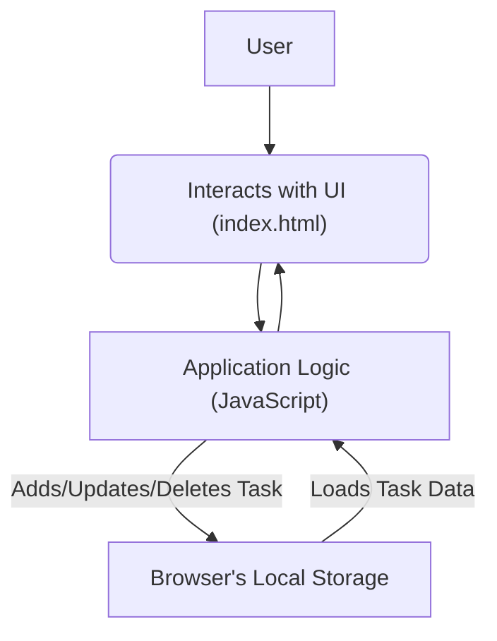

# 🚀 To-Do Application

<p align="center">
  <a href="https://github.com/grewal16/to-do/stargazers"></a>
  <a href="https://github.com/grewal16/to-do/network/members"></a>
  <a href="https://github.com/grewal16/to-do/issues"></a>
</p>

## Short Description

Unleash your productivity with the **To-Do Application** – a sleek, intuitive, and highly responsive web-based task manager designed to simplify your daily workflow. Forget complex setups; this application empowers you to effortlessly organize, prioritize, and track your tasks, ensuring you stay on top of your commitments. Built with a focus on a seamless user experience, it's the perfect companion for anyone looking to bring order to their busy life.

## ✨ Key Features

*   **Effortless Task Management:** Quickly add, edit, and mark tasks as complete with a clean and intuitive interface.
*   **Persistent Storage:** Your tasks are saved directly within your browser, ensuring your to-do list is always available even after closing the tab.
*   **Responsive Design:** Access and manage your tasks seamlessly across all devices, from desktops to smartphones.
*   **Zero Setup Required:** As a pure client-side application, simply open `index.html` in your browser and start organizing!
*   **Automated Workflow:** Leverages GitHub Actions for continuous integration and deployment, guaranteeing a stable and up-to-date experience.

## Who is this for?

*   **Individuals:** Looking for a straightforward way to manage personal tasks, errands, and daily chores.
*   **Students:** Needing to keep track of assignments, deadlines, and study schedules.
*   **Developers:** Interested in a clean, maintainable example of a client-side web application built with HTML, CSS, and JavaScript.
*   **Anyone:** Seeking a lightweight, no-fuss solution to enhance their daily productivity without external dependencies or complicated configurations.

## Technology Stack & Architecture

This To-Do application is crafted with a focus on simplicity and efficiency, primarily utilizing core web technologies:

*   **HTML5:** For the robust and semantic structure of the application.
*   **CSS3:** Providing a modern, clean, and responsive user interface.
*   **JavaScript:** Powering the interactive elements, task logic, and client-side data persistence.
*   **GitHub Actions:** Implementing CI/CD pipelines to automate testing and deployment workflows.

The architecture is entirely **client-side focused**, meaning all application logic and data storage reside within the user's browser. This approach ensures maximum privacy, speed, and eliminates the need for any backend server or database infrastructure, making it incredibly lightweight and easy to deploy.

## 📊 Architecture & Database Schema

As a purely client-side application, this To-Do list does not rely on a traditional database server. Instead, it ingeniously utilizes the browser's **Local Storage** for persistent data management. Below is a high-level flowchart illustrating the interaction flow:



*   **User:** The end-user interacting with the To-Do list.
*   **UI (index.html):** The visible web page where tasks are displayed and manipulated.
*   **Application Logic (JavaScript):** The core intelligence that handles user input, manages task states, and orchestrates data interactions.
*   **Browser's Local Storage:** A simple, key-value pair storage mechanism built into web browsers, used here to persist task data locally on the user's machine.

## ⚡ Quick Start Guide

Getting started with the To-Do Application couldn't be easier!

1.  **Clone the Repository:**
    ```bash
    git clone https://github.com/grewal16/to-do.git
    cd to-do
    ```

2.  **Open in Your Browser:**
    Simply open the `index.html` file in your preferred web browser.
    ```bash
    open index.html # On macOS
    # or
    start index.html # On Windows
    # or manually navigate to the file and open it
    ```
    Your To-Do list is now ready for action! Start adding tasks and experience streamlined productivity.