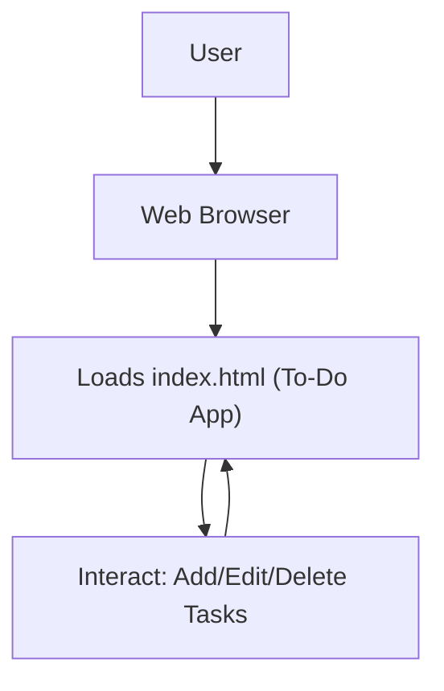

# 🚀 To-Do App

<p align="center">
  <a href="https://github.com/grewal16/to-do/stargazers"></a>
  <a href="https://github.com/grewal16/to-do/network/members"></a>
  <a href="https://github.com/grewal16/to-do/issues"></a>
</p>

## Short Description
Unlock unparalleled productivity with the **To-Do App**, a sleek and intuitive web-based task management solution. Designed for efficiency and ease of use, this application empowers you to effortlessly organize your daily tasks, track progress, and conquer your goals with a clear, engaging interface. Streamline your workflow and transform how you manage your priorities, all within your browser.

## ✨ Key Features
*   **Intuitive User Interface:** A clean, responsive design ensures a seamless experience for managing your tasks.
*   **Effortless Task Management:** Quickly add, edit, and delete tasks to keep your to-do list always up-to-date.
*   **Zero-Config Setup:** Get started instantly by simply opening a single HTML file – no complex installations required.
*   **Automated Deployment Ready:** Leverages GitHub Actions for robust CI/CD, indicating a project built for reliability and continuous delivery.

## Who is this for?
*   **Productivity Enthusiasts:** Individuals seeking a simple yet powerful tool to organize their daily routines and personal projects.
*   **Developers & Learners:** An excellent example of a standalone web application, perfect for examining client-side development.
*   **Minimalists:** Anyone who appreciates a clutter-free and efficient approach to task management without unnecessary complexities.

## Technology Stack & Architecture
The To-Do App is primarily a client-side web application, demonstrating a straightforward approach to modern web development.

*   **Frontend:** Built with fundamental web technologies, relying on **HTML** for structure, and likely complemented by CSS for styling and JavaScript for dynamic task management.
*   **Automation & CI/CD:** Utilizes **GitHub Actions** for workflow automation, ensuring consistent builds and deployment processes, laying the groundwork for a robust and easily maintainable project.

## 📊 Architecture & Database Schema
This application follows a simple, direct architecture, operating primarily within the user's web browser. There is no external database; data persistence would typically be handled client-side (e.g., local storage).



## ⚡ Quick Start Guide
Getting started with the To-Do App is incredibly simple and requires no backend setup or complex dependencies.

1.  **Clone the Repository:**
    ```bash
    git clone https://github.com/grewal16/to-do.git
    ```
2.  **Navigate to the Project Directory:**
    ```bash
    cd to-do
    ```
3.  **Open in Your Browser:**
    Simply open the `index.html` file in your preferred web browser:
    ```bash
    open index.html # On macOS
    start index.html # On Windows
    xdg-open index.html # On Linux
    ```
    Alternatively, drag and drop `index.html` directly into your browser window.

You're now ready to start managing your tasks!