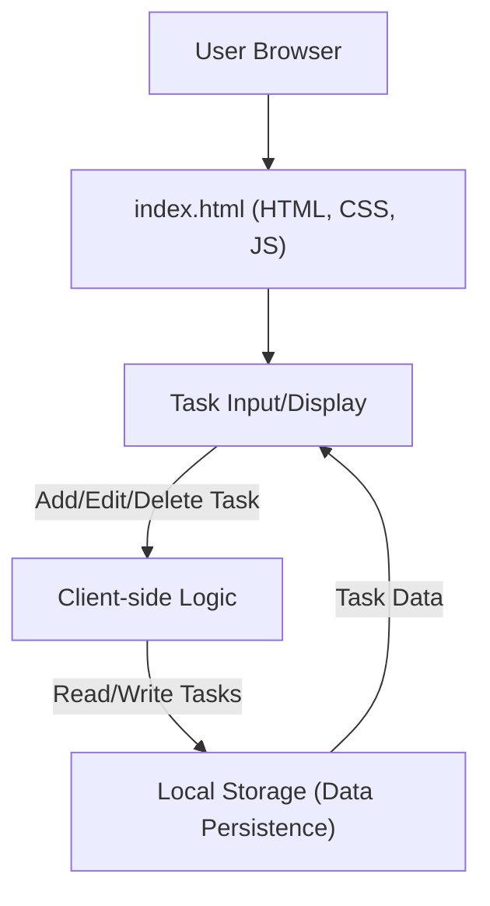

# 🚀 to-do

## Short Description
Unleash your productivity with **to-do**, a sleek and powerful client-side web application designed to simplify your daily task management. From quick errands to complex project milestones, this intuitive tool empowers you to organize, prioritize, and conquer your to-do list with remarkable ease.

## 🛡️ Project Health & Status
This project is under active and enthusiastic development, benefiting from a robust CI/CD pipeline orchestrated via `.github/workflows/main.yml`. This ensures that every commit is automatically validated, built, and potentially deployed, guaranteeing a high standard of code quality and swift delivery of new features and enhancements.

## ✨ Key Features
*   **Intuitive Task Creation:** Quickly add new tasks with minimal friction.
*   **Effortless Task Management:** Mark tasks as complete, edit details, or remove them with simple interactions.
*   **Client-Side Power:** Enjoy a fast, responsive experience without constant server communication.
*   **Clean & Modern UI:** A user-friendly interface that keeps your focus on what matters most – your tasks.

## Who is this for?
**to-do** is perfect for anyone seeking a straightforward, efficient, and readily accessible solution for personal task organization. Whether you're a student managing assignments, a professional tracking daily objectives, or simply someone who loves to stay organized, this application provides the clarity you need to keep on top of your responsibilities.

## Technology Stack & Architecture
This project leverages the foundational pillars of web development to deliver a dynamic client-side experience:

*   **HTML5:** The structural backbone of the application.
*   **CSS3:** For a polished, responsive, and aesthetically pleasing user interface.
*   **JavaScript:** Powering all interactive elements and client-side logic for task management.

The application is architected as a static web application, providing a fast and reliable user experience directly within the browser.

## 📊 Architecture & Database Schema
The architecture of the `to-do` application is designed for simplicity and efficiency, operating primarily on the client-side.



## ⚙️ Configuration & Deployment
Given its nature as a client-side static web application, `to-do` requires minimal configuration. The `.github/workflows/main.yml` indicates that the project is set up for automated building and deployment, typically to a static site hosting service.

To run locally, no complex build steps are required.

## ⚡ Quick Start Guide
Getting **to-do** up and running is incredibly simple:

1.  **Clone the repository:**
    ```bash
    git clone https://github.com/grewal16/to-do.git
    cd to-do
    ```
2.  **Open in your browser:**
    Simply open the `index.html` file directly in your preferred web browser.
    ```bash
    # Example for macOS/Linux (might vary)
    open index.html
    # Or, serve with a simple Python web server for better practice
    python -m http.server 8000
    # Then navigate to http://localhost:8000
    ```
You're now ready to start managing your tasks!