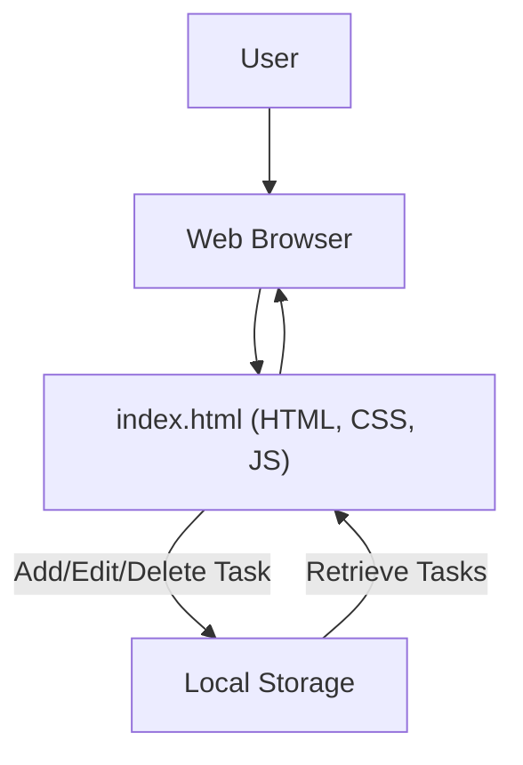

# 🚀 To-Do Application

<p align="center">
  <a href="https://github.com/grewal16/to-do/stargazers"></a>
  <a href="https://github.com/grewal16/to-do/network/members"></a>
  <a href="https://github.com/grewal16/to-do/issues"></a>
</p>

## Short Description
Dive into the elegance of simplicity with the To-Do Application! This project delivers a clean, intuitive, and highly functional web-based task manager designed for peak productivity. Built as a single-page application, it offers a seamless experience for organizing your daily tasks without any backend complexities, leveraging the power of client-side technologies. Get things done, effortlessly.

## ✨ Key Features
*   **Intuitive Task Management:** Effortlessly add, view, mark as complete, and delete tasks.
*   **Single-Page Application (SPA):** A smooth, responsive user interface delivered through a single `index.html` file.
*   **Client-Side Persistence:** Tasks are managed directly in your browser, ensuring quick access and minimal overhead.
*   **Clean & Minimalist Design:** Focus on your tasks without unnecessary distractions.
*   **CI/CD Ready:** Configured with GitHub Actions for automated workflows and streamlined development.

## Who is this for?
*   **Aspiring Front-End Developers:** A perfect hands-on example for understanding HTML, CSS, and vanilla JavaScript in a practical context.
*   **Users Seeking Simplicity:** Anyone who needs a straightforward, no-frills task manager without complex features or cloud dependencies.
*   **Educators & Students:** An excellent foundational project for learning web development basics.
*   **Minimalists:** Embrace a tool that does one thing, and does it well.

## Technology Stack & Architecture
This To-Do Application boasts a lightweight yet robust front-end stack, keeping the focus entirely on client-side performance and user experience.

*   **HTML5:** The structural backbone of the application.
*   **CSS3:** For a clean, modern, and user-friendly aesthetic.
*   **JavaScript (Vanilla):** Powers all interactive elements and client-side logic, including task management and persistence.
*   **GitHub Actions:** Automates continuous integration and deployment processes, ensuring code quality and efficient delivery.

## 📊 Architecture & Database Schema

This project utilizes a simple client-side architecture. There is no traditional database schema as data is handled locally.



## ⚡ Quick Start Guide
Getting the To-Do Application up and running is incredibly simple:

1.  **Clone the repository:**
    ```bash
    git clone https://github.com/grewal16/to-do.git
    cd to-do
    ```
2.  **Open `index.html`:**
    Simply open the `index.html` file in your preferred web browser. No server or build process is required!

    Alternatively, to serve it with a local web server (e.g., using Python for development):
    ```bash
    python -m http.server
    ```
    Then, navigate to `http://localhost:8000` in your browser.